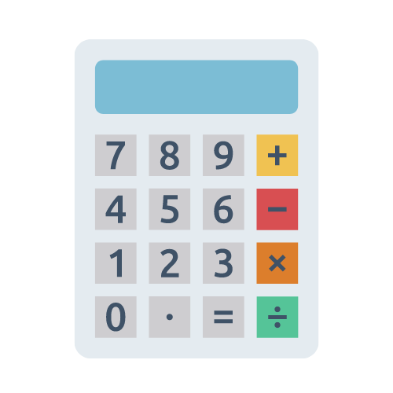
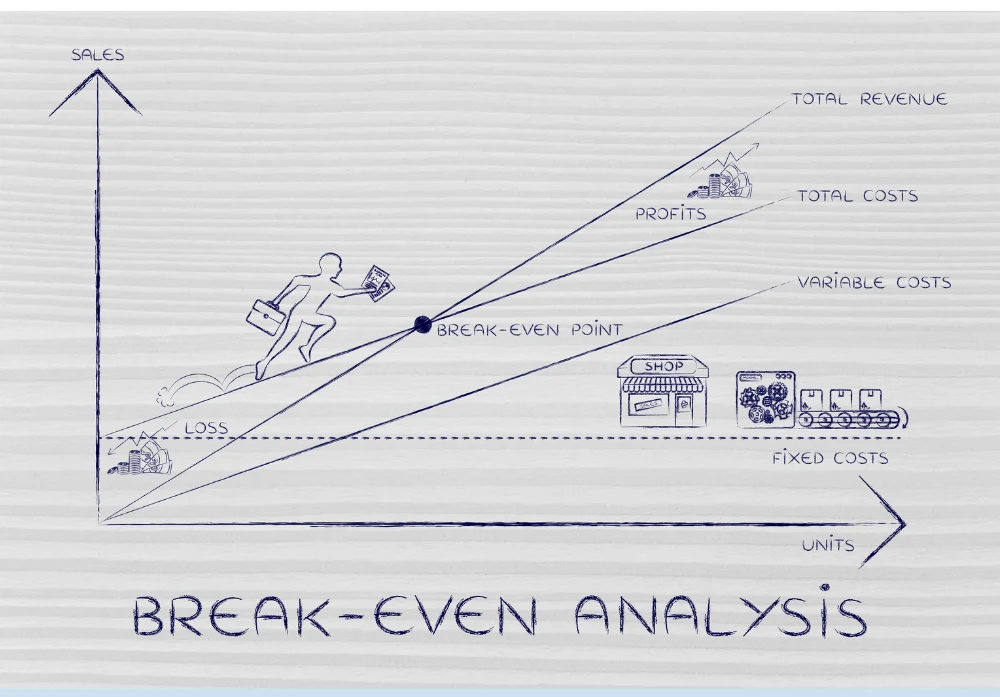

Free business and financial Calculators available for all. Try our TVM Calculator.

### Car Loan Calculator

Plan your car payments, see how much you can expect to owe and account for changes to your interest rate.

### Life Clock Calculator

If the average life expectancy were compressed into a single 24 hour calendar, how far into the day would you be? Let’s find out.

### Other Popular Calculators

Check out some of our other popular calculators including a random number generator used for giveaways, a break-even point calculator to help you understand if and when you're making a profit and a representative sample calculator so you can actually do polls that matter.

#### [Random Email Picker](/randomly-select-contest-winner-from-list-of-emails/)

Running a giveaway and need to randomly select a winning email from a list of emails? Use our free tool that will pick the winner for you.

#### [Break Even Point Calculator](/break-even-point-calculator/)

Enter your fixed costs, sale price per unit and variable cost per unit and figure out where your break-even point is.

#### [Representative Sample Calculator](/representative-sample-calculator/)

Need to calculate the representative sample of a target population? Enter the population size, the confidence level and the margin of error percentage desired.

#### [Online Mortgage Loan Calculator](/mortgage-loan-calculator-online/)

Welcome to our simple but user-friendly Online Mortgage Loan Calculator, designed to provide quick and accurate estimates for your mortgage payments.
